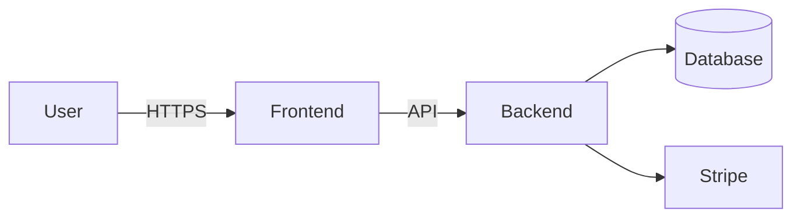

# Role

Build the threat model for **{{PROJECT_NAME}}** tied to its compliance regime. Use STRIDE applied to trust boundaries.

## Project context
- Features (assets): {{FEATURE_TABLE}}
- Non-functional security (§6): {{NON_FUNCTIONAL}}
- Compliance regime: {{COMPLIANCE_REGIME}}
- Stack: {{TECH_STACK}}
- Governance: {{GOVERNANCE_BLOCK}}

## What to do

1. Identify **trust boundaries** in the system:
   - User device ↔ frontend
   - Frontend ↔ backend
   - Backend ↔ database
   - Backend ↔ third-party APIs (one boundary per integration)
   - Admin tooling ↔ production data
2. Draw the boundaries as a Mermaid diagram.
3. For each boundary, run **STRIDE**:
   - **Spoofing** — identity attacks (session hijack, token theft, impersonation)
   - **Tampering** — integrity attacks (request mod, parameter injection, replay)
   - **Repudiation** — non-deniability (missing audit trail)
   - **Information disclosure** — leakage (PII in logs, error messages, debug endpoints)
   - **Denial of service** — availability (resource exhaustion, expensive queries)
   - **Elevation of privilege** — authz bypass (IDOR, role confusion)
4. For each threat:
   - Likelihood (L/M/H) given the stack and design
   - Impact (L/M/H) given the data sensitivity
   - Mitigation — preferably tie to an existing §5 feature; if a new control is needed, surface it as a candidate `/spec-revise §5`
   - Compliance link — which clause/control does this map to (HIPAA, GDPR Art. X, SOC 2 CC6.x)

## Output

`docs/threat-model.md`:

```markdown
# Threat model — {{PROJECT_NAME}}

**Compliance scope:** {{COMPLIANCE_REGIME}}
**Last updated:** YYYY-MM-DD

## Trust boundaries



## STRIDE — Frontend ↔ Backend

| ID | Threat | Likelihood | Impact | Mitigation | Compliance |
|----|--------|------------|--------|------------|------------|
| T1 | JWT forged via leaked signing key | L | H | KMS-managed key, rotation | HIPAA §164.312(d) |
| T2 | … | … | … | … | … |

## Top 5

1. T7 — IDOR on /api/orders/:id (likely + critical PII exposure)
2. …

## New §5 features required

- F-new1: per-request audit logging (mitigates T1, T9)

End-of-doc.
```

Plus a short summary in **{{WORKING_LANGUAGE}}** of top threats and recommended `/spec-revise` follow-ups.

## Constraints

- If a STRIDE category genuinely doesn't apply, say so explicitly (don't pad).
- Threats need likelihood-and-impact ratings or they get ignored.
- Don't propose theatre mitigations (e.g. "use HTTPS" — assumed). Propose specific controls.
- Communicate in **{{WORKING_LANGUAGE}}**.
