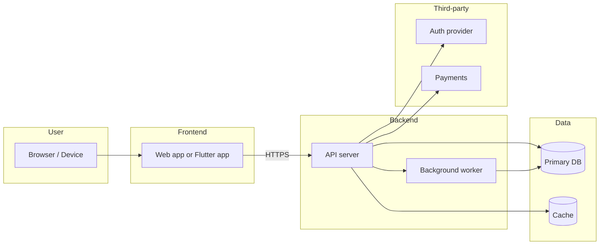

# Architecture — {{PROJECT_NAME}}

**Type:** {{PROJECT_TYPE}}
**Stack:** {{TECH_STACK}}
**Last updated:** {{TODAY}}

One-page C4 level-2 (container) diagram. For deeper detail, see code + `docs/api-contract.yaml`.

## Container diagram

*(Adapt to the actual {{TECH_STACK}}. For Spreadsheet projects, replace with a "sheets + data sources" diagram.)*

## Components

### `<Component>`
- **Responsibility:** one sentence
- **Tech:** language, framework, hosting
- **Inputs / Outputs:** what it consumes and produces
- **Failure mode:** what happens if it's down

*(Repeat per container.)*

## Cross-cutting concerns

- **Auth:** *(from §7 — provider, scheme, session lifetime)*
- **Logging / observability:** where logs go, retention, who can read
- **Secrets:** where they live, who has access
- **Deployment:** how new versions ship

## Open decisions

- [ ] Single region or multi-region?
- [ ] Sync vs async for `<feature>`?
- [ ] Caching strategy: at API or CDN?

Resolve via `/spec-revise §7`.
