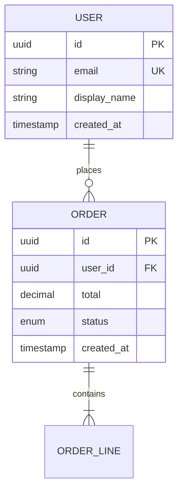

# Data model — {{PROJECT_NAME}}

**Derived from:** `SPEC.md` §5 features and §4 journeys.
**Refresh:** `/bundle-refresh` after any `/spec-revise §5`.

## Entity-relationship diagram

*(Replace with entities derived from {{FEATURE_TABLE}} — minimum: one entity per major noun the spec mentions.)*

## Entities

### `<Entity name>`
- **Purpose:** what feature(s) this serves (link to F-IDs)
- **Key fields:** id, plus business fields
- **Lifecycle:** when created, when deleted (or retained)
- **PII / sensitive:** mark fields covered by {{COMPLIANCE_REGIME}}

*(Repeat per entity.)*

## Open questions

- [ ] Multi-tenancy: shared schema with tenant_id, or schema-per-tenant?
- [ ] Soft delete vs hard delete (relevant for GDPR right-to-erasure)
- [ ] Audit log: separate table or append-only column?

These resolve via `/spec-revise §5` or `§9`.
