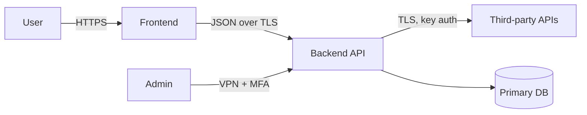

# Threat model — {{PROJECT_NAME}}

**Compliance scope:** {{COMPLIANCE_REGIME}}
**Last updated:** {{TODAY}}
**Refresh trigger:** any `/spec-revise` on §5 / §6 / §7, or annually.

*(Skip this file entirely if §6 compliance = none and the app has no auth/PII/financial flow.)*

## Trust boundaries

## STRIDE — Frontend ↔ Backend

| ID | Threat | Likelihood | Impact | Mitigation | Compliance link |
|----|--------|------------|--------|------------|-----------------|
| T1 | JWT signing key leak | L | H | KMS-managed key, 90d rotation | HIPAA §164.312(d), SOC 2 CC6.1 |
| T2 | IDOR on `/api/orders/:id` | M | H | Authz check tied to `user.id` on every read | GDPR Art. 32 |
| T3 | XSS in user-provided content | M | M | CSP + DOMPurify + framework escaping | OWASP A03 |

*(Repeat sections per trust boundary: User↔FE, FE↔BE, BE↔Vendors, Admin↔BE.)*

## Top 5 threats

1. **T2** — IDOR risk; mitigation depends on §9 RBAC implementation
2. **T7** — Vendor X compromise; we depend on their security posture
3. …

## New §5 features required to mitigate

| Threat | New feature | Suggested priority |
|--------|-------------|--------------------|
| T1 | Per-request audit log | MVP |
| T-x | … | … |

These become `/spec-revise §5` candidates.

## Compliance mapping

| Control | Mitigated by | Evidence |
|---------|--------------|----------|
| HIPAA Audit Controls | T1 mitigation + audit-log feature | Code review + logs sample |
| GDPR Art. 32 | T2 + T3 + encryption at rest | Architecture diagram + DB config |
